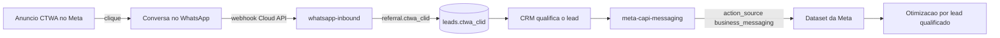

# CTWA — Atribuição e Conversions API

> [!abstract] O que é
> Pipeline que captura o **`ctwa_clid`** (click id do anúncio Click-to-WhatsApp) no webhook de entrada e o devolve à Meta via **Conversions API para Business Messaging** quando o lead é **qualificado**. Faz a Meta otimizar pelo **evento de negócio** em vez de "conversa iniciada".

## Por que existe

Hoje a Meta otimiza as campanhas `[WHATSAPP]` por **conversa por mensagem iniciada** — um proxy ruim: conta quem mandou "oi" e sumiu igual a quem virou cliente. Devolvendo `SubmitApplication` (lead qualificado) com o `ctwa_clid` original, o algoritmo passa a comprar **conversa que qualifica**, não conversa barata.

É o mesmo raciocínio da [[GA4 - Conversões Offline|exportação de conversões offline do GA4]], aplicado ao lado Meta: sem o identificador de origem, a plataforma não liga o desfecho ao clique.

## ⚠️ O bloqueio estrutural (ler primeiro)

> [!danger] `ctwa_clid` só existe na Meta Cloud API
> O click id chega **exclusivamente** no webhook oficial, em `entry[].changes[].value.messages[].referral.ctwa_clid`, e **só na primeira mensagem** da conversa aberta pelo anúncio.
>
> - **App WhatsApp Business (celular):** não tem webhook. O CRM nunca vê a mensagem. Atribuição **impossível** — não é limitação de código.
> - **Z-API (não oficial):** não repassa o `ctwa_clid`. Capturamos os metadados do anúncio como fallback, mas a Meta cai em **match por telefone hasheado** — precisão bem menor.
> - **Meta Cloud API (oficial):** único caminho com atribuição real.
>
> Consequência prática: **o número de destino do anúncio precisa apontar para a WABA conectada à Cloud API.** Enquanto a WABA estiver travada por pagamento (erro `131042`), o pipeline fica inerte — grava o que der e não quebra nada.

## Fluxo ponta a ponta



## O payload exato (onde a maioria erra)

> [!warning] Dois campos definem tudo
> `action_source: "business_messaging"` e `messaging_channel: "whatsapp"`.
> Sem os dois, a Meta trata como conversão web e **não liga ao anúncio CTWA**.

```json
{
  "data": [{
    "event_name": "SubmitApplication",
    "event_time": 1784000000,
    "event_id": "<lead_id>:SubmitApplication",
    "action_source": "business_messaging",
    "messaging_channel": "whatsapp",
    "user_data": {
      "ctwa_clid": "<click id do referral>",
      "whatsapp_business_account_id": "<WABA_ID>",
      "ph": ["<sha256 do telefone>"]
    }
  }]
}
```

- **Vai para o `DATASET`, não para o pixel do site.** O dataset de business messaging é o vinculado à WABA no Gerenciador de Eventos. `META_MESSAGING_DATASET_ID` cai em `META_PIXEL_ID` se vazio — mas isso provavelmente está errado.
- **`ctwa_clid` e `whatsapp_business_account_id` vão em claro** (são IDs da própria Meta). Todo o resto — telefone, nome — vai **hasheado em SHA-256**.
- **`event_time`** deve ser o momento **real** do evento, não o do envio.
- **Eventos disponíveis:** `Lead`, `Contact`, `Schedule`, `SubmitApplication` (padrão = qualificado), `Purchase`.

## As peças

| # | Peça | Onde |
|---|---|---|
| 1 | Extração do referral (Cloud API + fallback Z-API) | `supabase/functions/whatsapp-inbound/ctwa.ts` |
| 2 | Captura e persistência no webhook | `supabase/functions/whatsapp-inbound/index.ts` |
| 3 | Montagem e envio do evento | `supabase/functions/meta-capi-messaging/capi.ts` |
| 4 | Endpoint chamado pelo CRM | `supabase/functions/meta-capi-messaging/index.ts` |
| 5 | Colunas `ctwa_clid`, `ctwa_source_id`, `ctwa_clid_at`, `ctwa_reported_at` | `supabase/migrations/20260719_ctwa_attribution.sql` |

## ⚠️ Armadilhas

> [!danger] Ler antes de mexer
> - **O clid só vem uma vez.** Chega na 1ª mensagem e nunca mais. Se não gravar ali, perdeu. Por isso persiste em `leads`/`contacts`, não só em `inbox_messages.metadata`.
> - **Nunca sobrescrever clid existente.** A Meta atribui o **primeiro** clique. O `update` filtra por `.is("ctwa_clid", null)`.
> - **Janela de atribuição.** A Meta descarta evento muito antigo. `ctwa_clid_at` guarda a data do clique; a função loga `age_days` para diagnóstico.
> - **Dedupe por `event_id`** = `lead_id:event_name`, e `ctwa_reported_at` bloqueia reenvio. Reportar duas vezes inflaria a métrica.
> - **Degradação silenciosa proposital.** Se a migração não tiver sido aplicada, a gravação do clid falha em silêncio — telemetria de atribuição **não pode derrubar o webhook** de mensagens.

## Configuração necessária

```
META_MESSAGING_DATASET_ID=   # dataset da WABA, NÃO o pixel do site
META_WABA_ID=                # Gerenciador do WhatsApp > Configurações da conta
META_CAPI_ACCESS_TOKEN=      # já existente
```

Deploy: `supabase functions deploy meta-capi-messaging` + redeploy de `whatsapp-inbound`. Migração aplicada colando o **conteúdo** do SQL.

## 🔴 Realidade de volume (não ignorar)

> [!important] Isto não corrige a conta de anúncios
> Em 19/07/2026 a conta `CA - Leonardo Brasil` (436061269210086) gastou **R$ 63,11 em 30 dias**, com **1 conversa** registrada e **0 leads de formulário**. Nenhum conjunto passou de R$ 3,65.
>
> A Meta precisa de **~50 eventos por conjunto por semana** para sair do aprendizado. Alimentar o algoritmo com 1 evento/mês é **ruído, não sinal**.
>
> Ordem correta: destravar a WABA → apontar os anúncios para o número da Cloud API → **consolidar orçamento** (de 11 conjuntos × R$ 10 para 2 × R$ 50) → só então a CAPI tem o que otimizar.
>
> Este pipeline é **encanamento correto para um cenário que ainda não existe**.

## Referências

- [Conversions API for Business Messaging](https://developers.facebook.com/documentation/ads-commerce/conversions-api/business-messaging)
- [Conversions API — Parameters](https://developers.facebook.com/documentation/ads-commerce/conversions-api/parameters)
- [[05 - API e Edge Functions]]
- [[GA4 - Conversões Offline]]
