# GA4 — Conversões Offline

> [!abstract] O que é
> Pipeline que leva as **conversões do CRM** (leads qualificados e vendas ganhas) para o **Google Analytics 4** via *Offline event data import*, para alimentar o **lance por valor** do Google Ads. Duas metades: **exportação** (CSV no schema do GA4) e **captura** (o `client_id` do GA4 gravado no lead a partir de um formulário web).

## Por que existe
Sem o `client_id` do GA4, ele **não liga a venda offline à visita web** ("Venda João" ↔ "Visita João"). Exportar a conversão **com** o `client_id` + **valor** faz o algoritmo do Google Ads otimizar por **lucro**, não por volume.

## Fluxo ponta a ponta

```mermaid
graph LR
  A[Visitante na Landing] -->|form nome+WhatsApp| B[JS captura o client_id via gtag/_ga]
  B --> C[Edge Function lead-intake]
  C -->|service-role + owner padrao| D[(leads.ga_client_id)]
  D --> E[Lead qualifica ou Oportunidade ganha]
  E --> F[Configuracoes: Exportar CSV GA4]
  F -->|client_id preenchido| G[GA4 Offline Import]
  G --> H[Google Ads: lance por valor]
```

## ⚠️ O schema EXATO do GA4 (onde a maioria erra)
> [!warning] Cabeçalhos exatos (minúsculos, em inglês)
> `measurement_id, client_id, event_name, timestamp_micros, event_param.value, event_param.currency`

- **`measurement_id`** — OBRIGATÓRIO. É o `G-NSMD6MKLMK` (o mesmo do gtag em `index.html`). *Faltar isso = erro "campo obrigatório".*
- **`event_param.value` / `event_param.currency`** — parâmetros de evento usam o **prefixo `event_param.`**. Mandar `value`/`currency` "pelados" = erro "nome de coluna inválido".
- **`timestamp_micros`** — Unix em **microssegundos** = `Date.getTime() × 1000`.
- **Eventos:** `offline_sale` (oportunidade **Ganho**, `value = valor`) e `qualified_lead` (lead `qualificado`, `value = valor_estimado`). `currency = BRL`.

## ⚠️ Armadilhas que fazem ou quebram tudo
> [!danger] Ler antes de mexer
> - **`client_id` é obrigatório** e o GA4 rejeita linha sem ele. Só lead de **formulário web** tem `client_id` (o cookie `_ga` do navegador). Lead de **WhatsApp/prospecção NÃO tem** — e não dá pra inventar. Logo, essa fonte só cobre o **canal de aquisição web**.
> - **Janela de ~72h:** o import só aceita eventos recentes. **Não serve para backfill** de vendas antigas — é cadência quase-tempo-real.
> - **`opportunities` NÃO tem `updated_at`** (só `created_at`). O `select` inicial pediu `updated_at` e quebrou (PostgREST 42703). Usamos `created_at`.
> - **Não existe `ganho_em`:** o `timestamp` do `offline_sale` é a **criação** da oportunidade, não a data do ganho. Um negócio criado há semanas mas ganho hoje cai **fora da janela de 72h**. Melhoria futura: coluna `ganho_em`.

## As 4 peças
| # | Peça | Onde |
|---|---|---|
| 1 | Coluna `ga_client_id` (nullable) | `leads` — migração `20260715170000_leads_ga_client_id.sql` |
| 2 | Intake público (grava o lead) | Edge Function **`lead-intake`** — service-role + `FUNIL_DEFAULT_OWNER_ID` + honeypot |
| 3 | Formulário web | `LeadCaptureForm.tsx` (seção na `Landing.tsx`, **sem rota nova**) |
| 4 | Exportador | `src/lib/ga4Export.ts` + `Ga4ExportSection.tsx` (Configurações → *Exportar CSV GA4*) |

### Captura do `client_id` (peça 2 + 3)
- O form pega o `client_id` via `gtag('get', 'G-NSMD6MKLMK', 'client_id', cb)` com **fallback** pro cookie `_ga` (regex nas 2 últimas partes: `GA1.1.<a>.<b>` → `<a>.<b>`).
- Posta na `lead-intake`, que **não pode** inserir direto (RLS por owner impede insert anônimo) → usa **service-role** e grava com `owner_id = FUNIL_DEFAULT_OWNER_ID`.
- **Anti-spam:** honeypot oculto + validação de telefone.
- **Degradação graciosa:** função e exportador funcionam **mesmo sem a migração** (só não gravam/leem o `ga_client_id`) — padrão `isMissingColumnError` do projeto.

### Exportador (peça 4)
- Lê **leads qualificados** (`ga_client_id` direto) e **oportunidades ganhas** (`ga_client_id` via **join** no lead vinculado: `select("... leads(ga_client_id)")`), com fallback se a coluna não existir.

## Ações de operação (owner)
1. Migração: `alter table public.leads add column if not exists ga_client_id text;`
2. Deploy: `npx supabase@latest functions deploy lead-intake --project-ref juvwfxnlusrnvcarkrmc --no-verify-jwt`
3. Secret **`FUNIL_DEFAULT_OWNER_ID`** = UUID do owner (o `owner_id` que possui os dados do CRM). Sem ele → 500 "Configuração ausente".
4. **GA4 → Admin → Eventos:** marcar `offline_sale` e `qualified_lead` como **evento-chave**; depois **vincular ao Google Ads**.

> [!tip] Ordem importa
> Deploye a função **antes** de o front ir ao ar — senão o form aparece mas dá **404/CORS** (o preflight bate num 404). Nada quebra, só o form não envia até a função existir.

## Estado — validado com dado real (17/07/2026)
> [!success] Ciclo fechado ponta a ponta
> Lead **"Teste 2"** gravado com `ga_client_id = 342694340.1784049576` a partir do formulário. Falta apenas a config no GA4/Ads (evento-chave + vínculo). A **captura** e a **exportação** estão provadas.

## Relacionados
[[05 - API e Edge Functions]] · [[02 - Arquitetura e Design]] · [[03 - Changelog]] · [[04 - Roadmap]]
