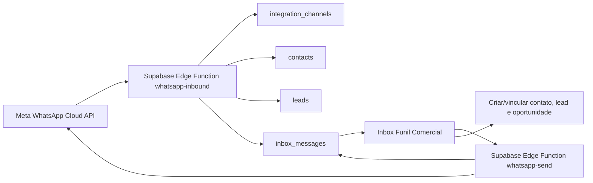

# WhatsApp Cloud API Integration

Data: 2026-07-04

## Viabilidade

A integracao e viavel com a arquitetura atual sem alterar a navegacao ou o
design geral do Funil Comercial. O front-end ja possui o fluxo essencial no
Inbox: listar conversas, criar/vincular contato, qualificar lead, criar
oportunidade e mover oportunidade no funil.

A proxima camada necessaria e o recebimento confiavel de mensagens reais. A
abordagem recomendada e usar a WhatsApp Business Platform Cloud API da Meta,
apontando o webhook `messages` para a Supabase Edge Function
`whatsapp-inbound`.

## Arquitetura atual

- Front-end React/Vite consulta Supabase diretamente usando `supabase-js`.
- Autenticacao e sessao sao feitas pelo Supabase Auth.
- RLS isola dados por `owner_id` nas tabelas de CRM.
- `integration_channels` guarda canais conectados por owner.
- `inbox_messages` e a fonte de verdade das mensagens exibidas no Inbox.
- Contatos, leads e oportunidades ja possuem vinculos manuais pelo app.

## Arquitetura recomendada



## Fluxo completo

1. Gestor cadastra o canal no Inbox com provider `whatsapp` e numero oficial.
2. Meta valida o endpoint por `GET` usando `META_WEBHOOK_VERIFY_TOKEN`.
3. Meta envia eventos `messages` para a Edge Function.
4. A funcao valida `X-Hub-Signature-256` quando `META_APP_SECRET` existe.
5. A funcao normaliza telefone, nome, tipo e texto da mensagem.
6. A funcao resolve o owner por `integration_channels`.
7. A funcao procura contato e lead ativos pelo telefone do remetente.
8. A funcao registra a mensagem em `inbox_messages`.
9. O Inbox agrupa mensagens por telefone e exibe o historico.
10. O usuario cria/vincula contato, qualifica lead e cria oportunidade.
11. O usuario responde pelo Inbox.
12. A funcao `whatsapp-send` envia a resposta pela Cloud API quando o canal esta
    configurado, registra o outbound e marca a conversa como respondida.

## Modelo de dados

Entidades ja existentes:

- `integration_channels`: canal conectado por provider, numero, status e owner.
- `inbox_messages`: historico de mensagens inbound/outbound por telefone.
- `contacts`: cadastro canonico por owner e telefone unico.
- `leads`: qualificacao comercial vinculavel ao contato.
- `opportunities`: oportunidade vinculavel ao lead.
- `pipeline_stages`: etapas do funil por owner.
- `profiles`: usuario e papel.

Decisao de MVP: nao criar tabela `conversations` agora. A conversa continua
derivada de `inbox_messages` agrupadas por telefone, reduzindo migracoes e
preservando a UI atual. Se o volume crescer, a proxima evolucao natural e criar
`inbox_conversations` com status, responsavel, SLA e ultimo evento.

## Endpoints e webhooks

Endpoint:

```text
GET/POST /functions/v1/whatsapp-inbound
POST /functions/v1/whatsapp-send
```

Webhooks envolvidos:

- Meta verification challenge: `GET` com `hub.mode`, `hub.verify_token` e
  `hub.challenge`.
- Meta incoming messages: `POST` com payload `whatsapp_business_account`.
- Webhooks genericos: `POST` JSON ou form-urlencoded com `from`, `to`,
  `message`, `name`, `id`.
- Outbound text message: `POST` autenticado para `whatsapp-send`.

## Variaveis de ambiente

Edge Function:

- `SUPABASE_URL`
- `SUPABASE_SERVICE_ROLE_KEY`
- `META_WEBHOOK_VERIFY_TOKEN`
- `META_APP_SECRET`
- `META_WHATSAPP_ACCESS_TOKEN`
- `META_WHATSAPP_PHONE_NUMBER_ID`
- `META_GRAPH_API_VERSION`
- `FUNIL_WEBHOOK_SECRET`
- `FUNIL_DEFAULT_OWNER_ID`

Front-end:

- `VITE_SUPABASE_URL`
- `VITE_SUPABASE_ANON_KEY`

Banco local/migrations:

- `SUPABASE_DB_URL`

## Arquivos afetados

- `supabase/functions/whatsapp-inbound/index.ts`
- `supabase/functions/whatsapp-inbound/README.md`
- `supabase/functions/whatsapp-send/index.ts`
- `supabase/functions/whatsapp-send/README.md`
- `docs/whatsapp-cloud-api-integration.md`
- `README.md`

## Seguranca e conformidade

- Tokens e service role ficam somente em secrets da Edge Function.
- A assinatura `X-Hub-Signature-256` e validada quando `META_APP_SECRET` esta
  configurado.
- Logs nao incluem conteudo da mensagem, tokens, connection string ou payload
  bruto.
- O app mantem RLS no front-end; a Edge Function usa service role apenas no
  limite do webhook.
- O fluxo evita duplicidade usando telefone canonico e indice unico de
  `provider_message_id`.
- O envio outbound exige usuario autenticado e canal ativo pertencente ao owner.
- Dados pessoais sao limitados ao necessario: nome disponivel, telefone e corpo
  da mensagem.

## Rollback

1. Reverter o commit da branch da integracao.
2. Reimplantar a versao anterior de `supabase/functions/whatsapp-inbound` e
   remover/desativar `supabase/functions/whatsapp-send`, se publicada.
3. No painel da Meta, desativar temporariamente o webhook `messages` ou apontar
   para a versao anterior.
4. Manter `integration_channels` e `inbox_messages`; nao ha migration destrutiva
   nesta entrega.
5. Caso necessario, pausar o canal pelo Inbox para impedir novas entradas.

## Riscos e dependencias

- A Cloud API exige Business Manager, app Meta e numero aprovado.
- Sem `META_APP_SECRET`, a assinatura oficial nao e validada.
- Se o numero oficial nao estiver cadastrado em `integration_channels`, a funcao
  usa `FUNIL_DEFAULT_OWNER_ID` quando configurado; sem fallback, retorna erro.
- Status de entrega/envio ainda nao atualizam mensagens outbound.
- O envio de templates fora da janela de atendimento de 24 horas ainda nao esta
  implementado.
- Responsavel por atendimento e tabela dedicada de conversas ainda sao proximas
  evolucoes.

## Criterios de aceite

- Meta valida o webhook por `GET`.
- Mensagem nova da Cloud API cria registro em `inbox_messages`.
- Mensagem duplicada com mesmo `provider_message_id` nao duplica o Inbox.
- Remetente existente e vinculado por telefone a contato/lead.
- Remetente desconhecido aparece como nova conversa sem criar duplicidade.
- Resposta do Inbox e enviada pela Cloud API quando o canal esta configurado.
- Sem secrets de envio, resposta continua registrada localmente no historico.
- Usuario consegue criar contato, lead e oportunidade pelo Inbox.
- Build do front-end continua passando.

## Configuracao do numero

1. Criar ou selecionar o app no painel da Meta.
2. Ativar WhatsApp Business Platform.
3. Adicionar o numero oficial e concluir a verificacao exigida pela Meta.
4. Configurar a Callback URL da Edge Function.
5. Informar o mesmo verify token salvo em `META_WEBHOOK_VERIFY_TOKEN`.
6. Assinar o campo `messages`.
7. No Funil Comercial, cadastrar canal:
   - tipo: `whatsapp`
   - nome: nome operacional do numero
   - numero: numero oficial com DDI, somente digitos
   - ID do numero na Meta: `phone_number_id`, opcional quando houver secret
     global `META_WHATSAPP_PHONE_NUMBER_ID`
   - status: `ativo`
8. Configurar `META_WHATSAPP_ACCESS_TOKEN` e `META_WHATSAPP_PHONE_NUMBER_ID`
   para permitir respostas reais.
9. Enviar mensagem de teste para o numero e conferir a entrada no Inbox.
10. Responder pelo Inbox e conferir a chegada no WhatsApp.
